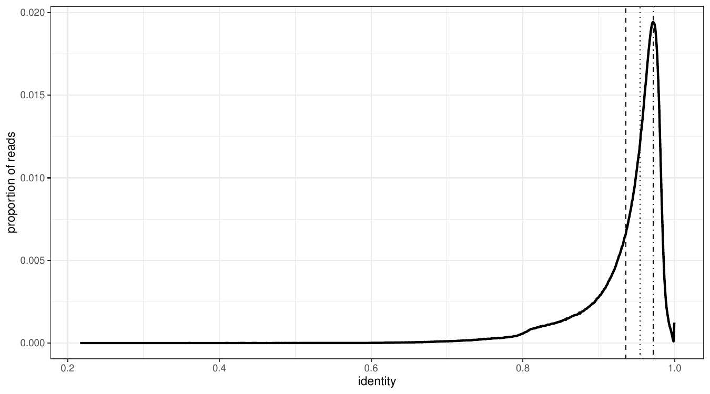

# wambam

**W**hy **A**sk **M**ycolleguesabouttheiropinionsonhowtonamemytoolanalyzing **BAM**s

Wambam is made for quick bam QC: read identity, read lengths, N50, total yield.

## Usage

Use with:

```sh
wam -i reads.bam -o wambam_results
```

The input BAM must be made by aligning long reads with [minimap2](https://github.com/lh3/minimap2) using the `--eqx` flag.

The output directory specified with `-o` will be created and must not exist. 
It will contain the following output files:

- `identity_distribution.csv` contains the number of reads for each unique identity.
- `length_distribution.csv` contains the number of reads for each read length.

These two files can be used to plot the distribution of identity, read length, N50 (see [Graphs and summary statistics](#graphs-and-summary-statistics)).

## Docker container

A docker container with wambam is deployed at [`quay.io/jmonlong/wambam`](https://quay.io/repository/jmonlong/wambam).
It was made with this [Dockerfile](Dockerfile).

It also has R and the packages necessary to make the graphs and summary statistics with [the scripts described below](#graphs-and-summary-statistics).

Within the docker container, this repo is located at `/build/wambam`. 
So the script to make plots is at `/build/wambam/scripts/make_plots.R` for example.

## WDL workflow

A WDL workflow is available to:

1. align the reads with minimap2 (if necessary)
2. run wambam
3. make some graphs and compute summary stats

The workflow is [deposited on Dockstore](https://dockstore.org/workflows/github.com/nanoporegenomics/wambam/wambam:main?tab=info).

The tasks, workflow, and example input are in the [`wdl` folder](wdl).

To test locally with [Cromwell](https://cromwell.readthedocs.io/en/stable/):

```sh
java -jar $CROMWELL_JAR run wdl/workflow.wdl -i wdl/testdata_input.json
```

*`$CROMWELL_JAR` points at a `cromwell-*.jar` [Cromwell release](https://github.com/broadinstitute/cromwell/releases).*

## Graphs and summary statistics

The [scripts/make_plots.R](scripts/make_plots.R) script shows how to make some graphs and compute the summary statistics (e.g. median identity, read N50).
It's used in the WDL workflow described above.

To use it locally:

```sh
Rscript make_plots.R identity_distribution.csv length_distribution.csv wambam-graphs.pdf wambam-summary.csv
```

Here are a few examples of graphs made by the scripts (and WDL):

#### Identity distribution



#### Identity distribution zoomed in


#### Read length distribution (log-scaled axis)


#### Read length NX


*The 0-0.05 range is not shown to improve visibility because the longest reads tend to dwarf the rest of the distribution and we are more interested in the higher NXs.*
